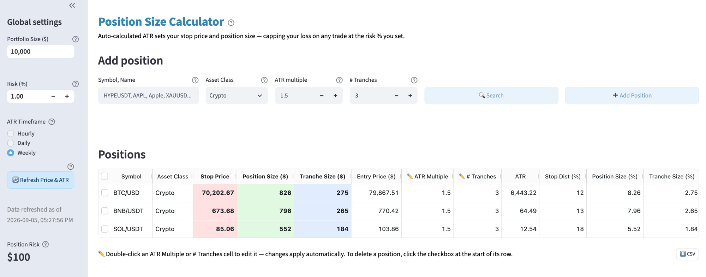

# Position Size Calculator

Works out how big a position to take, from your portfolio size, the risk you
accept per trade, and the instrument's ATR. Runs entirely on your own machine —
no account, no sign-up, and your numbers never leave the computer.

> **Not financial advice.** This is a calculator, not a recommendation. It tells
> you what a position size *would* be under the risk rule you gave it; it has no
> opinion on whether the trade is a good one. Market data comes from a
> third-party source and may be delayed, wrong, or missing. You are responsible
> for every order you place. The software comes with no warranty of any kind —
> see [LICENSE](LICENSE).

<!-- Screenshot: add a PNG of the app with a portfolio size set and two or three
     positions loaded, then reference it here as:
      -->

## What it works out

You give it four things per position — entry price, ATR multiple, number of
tranches, and the symbol — plus two settings that apply to everything: your
portfolio size and the percentage of it you are willing to lose on one trade.
It fetches the instrument's ATR and computes:

```
risk budget  (R) = portfolio size x risk %
stop distance    = ATR x ATR multiple
stop price       = entry price - stop distance
position size $  = R / (stop distance / entry price)
tranche size $   = position size / number of tranches
```

The useful part is the divisor. Because the stop distance is expressed as a
*fraction of entry*, position size scales inversely with volatility: a wide-ATR
instrument automatically gets a smaller position for the same dollar risk, so
every open position risks the same amount even though their charts do not look
alike.

If the ATR multiple is wide enough to put the stop at or below zero, the app
says so instead of quietly reporting a size derived from an unplaceable stop.

## Getting it

```sh
git clone https://github.com/sokodm/position-size-calculator.git
cd position-size-calculator
```

You need **Python 3.10 or newer**. Nothing else — the first launch installs what
it needs into a `.venv` folder next to these files, and later launches skip
straight to opening the app.

## Running it

**macOS** — double-click `Start Calculator (Mac).command`

> The first time, macOS may say the file "cannot be opened because it is from an
> unidentified developer". **Right-click the file → Open → Open.** You only do
> this once. If it says "permission denied" instead, the executable flag was
> lost — that happens when the folder arrives as a downloaded ZIP rather than a
> `git clone`. Open Terminal in this folder and run
> `chmod +x "Start Calculator (Mac).command"`.

**Windows** — double-click `Start Calculator (Windows).bat`

> If you see "Python is not recognized", install Python from
> <https://www.python.org/downloads/> and **tick "Add python.exe to PATH"** on
> the installer's first screen.

Either way a terminal window opens, then your browser. **Leave the terminal
window open while you use the app** — closing it stops the app.

To run it by hand instead: `python3 run.py` (macOS) or `py -3 run.py` (Windows).

## First run

The app starts deliberately empty, so nothing is ever computed from someone
else's numbers:

- **Portfolio Size is blank.** Until you set it, the calculated columns stay
  empty — that is not a bug. Risk defaults to 1%.
- **Add a position by searching, not typing.** Enter a ticker *or* a full name
  ("SOL" or "solana", "BTC" or "bitcoin") and press **Search**. The app resolves
  which exchange actually lists it before adding the row, which is what lets the
  ATR lookup succeed later.
- **Your first search is the slow one.** It may check several exchanges;
  after that, results are cached for 60 seconds.

## Your data

Everything stays on your computer.

- **Your positions** live in `positions.json`, in this folder. Nothing is
  uploaded, and there is no account or login. Back up that one file and you have
  backed up your portfolio; delete it and you start empty. It is listed in
  `.gitignore`, so it will not follow you into a commit.
- **Portfolio size, risk percentage and entry prices never leave the machine.**
  The only thing sent out is a symbol, an exchange and a timeframe, in order to
  fetch prices and ATR.
- **Prices are cached in memory for 60 seconds** and vanish when you close the
  app. Nothing is cached to disk.

Because the portfolio is a plain file in this folder, **each person needs their
own copy**. Two people cannot share one installation — they would share one
portfolio and overwrite each other's saves.

## Where the prices come from

Market data comes from **TradingView**, via the `tradingview-mcp-server` package
and TradingView's public symbol-search endpoint. That endpoint is not a
documented, supported API: it can change or start refusing requests without
notice, and heavy automated use may fall outside TradingView's terms of service.
This app makes a handful of requests per lookup and caches for 60 seconds, which
is well within normal interactive use, but if you fork it and remove the caching,
that is on you.

There is no API key to configure, and no data provider account is needed.

## What gets installed

Dependencies are pinned in `requirements.txt` and installed into a local
`.venv` — nothing is installed system-wide.

| Package | Why |
|---|---|
| `streamlit==1.62.0` | the UI. Pinned exactly: the app's CSS targets this version's DOM, so a newer Streamlit can shift the layout |
| `streamlit-aggrid` | the editable positions table |
| `streamlit-extras` | UI components Streamlit core handles poorly |
| `tradingview-mcp-server` | price and ATR lookups |
| `pip-system-certs` | makes Python trust the operating system's certificate store |

That last one is only needed behind a corporate proxy that inspects TLS traffic
(Zscaler, Netskope and similar), where Python's bundled certificate list rejects
the proxy's certificate and every price lookup fails. On a home network it is
harmless but unnecessary — remove that line from `requirements.txt` if you would
rather not have it.

The `.venv` folder is roughly **700 MB** and is built for the OS that created
it. It is gitignored, and copying it between machines will not work — let each
machine build its own on first launch.

## License

[MIT](LICENSE).
